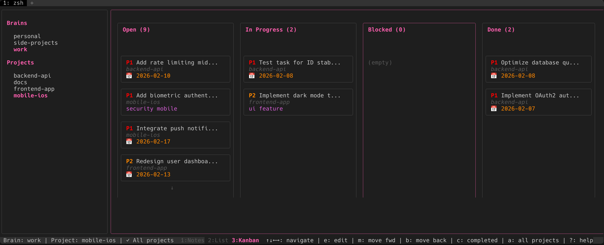
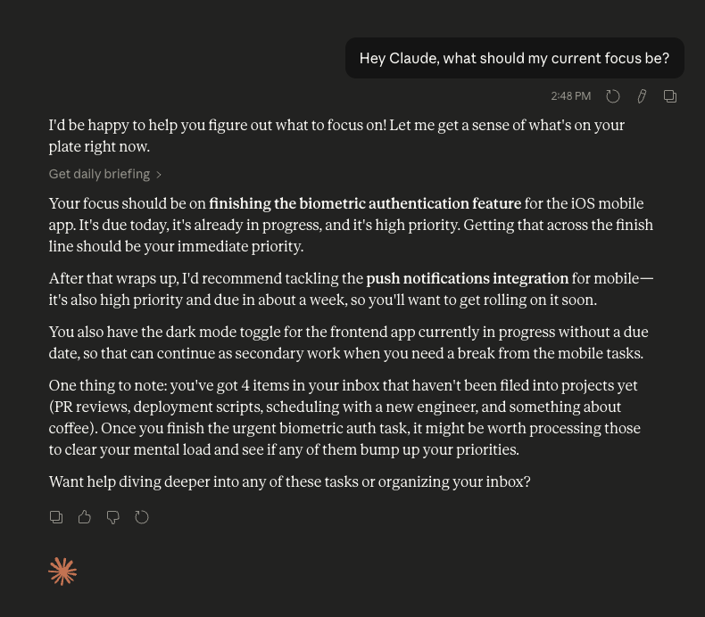

# Local Brain

```
 ______     ______     ______     __     __   __
/\  == \   /\  == \   /\  __ \   /\ \   /\ "-.\ \
\ \  __<   \ \  __<   \ \  __ \  \ \ \  \ \ \-.  \
 \ \_____\  \ \_\ \_\  \ \_\ \_\  \ \_\  \ \_\\"\_\
  \/_____/   \/_/ /_/   \/_/\/_/   \/_/   \/_/ \/_/
```

> A local-first project management tool — with a CLI/TUI for humans and an MCP server for AI agents.

[](https://sandermoon.github.io/local-brain/)
[](https://github.com/SanderMoon/local-brain)
[](https://opensource.org/licenses/MIT)

Local Brain keeps your projects, tasks, and notes in plain Markdown files on your own machine. Use it yourself via the CLI and TUI, or let an AI agent manage your projects through the built-in MCP server — or both.

---

## Two Interfaces, One System

### Human Interface — CLI & TUI



- **Zero-friction capture** — `brain add "..."` takes under a second, no context switching
- **Batch curation** — process and organize during dedicated time blocks with `brain refile` and `brain plan`
- **Full CLI** — every operation is a command; scriptable and composable
- **Optional TUI** — visual project and task overview with `brain tui`

### AI Interface — MCP Server

<!-- TODO: Add screenshot of chatting with Claude about projects/todos. Save to docs/images/claude-chat-screenshot.png -->


- **Efficient discovery** — tools like `get_brain_overview` return your full workspace in one call, instead of dozens of filesystem reads
- **Full task management** — Claude can create, update, search, and organize your tasks and projects directly
- **Personal assistant** — run `brain storm` to open Claude in your brains directory for an interactive session
- **17 purpose-built tools** — designed to minimize LLM round-trips while giving complete access to your projects

---

## Quick Start

### Install

```bash
# macOS/Linux (Homebrew)
brew tap SanderMoon/tap
brew install brain

# Or via Go
go install github.com/SanderMoon/local-brain@latest
```

### Initialize

```bash
brain init
```

### Use it your way

```bash
# Human path: capture → organize → act
brain add "Fix authentication bug"
brain add "Review Sarah's PR"
brain refile                        # batch-move items to projects
brain todo ls --priority 1          # see what matters today

# AI path: open Claude in your brains directory
brain storm                         # launches Claude Code in ~/brains
```

**[📖 Full Documentation →](https://sandermoon.github.io/local-brain/)**

---

## Core Workflow: Capture → Curate

**Phase 1: Capture** (< 1 second)

Dump everything to your inbox — no metadata, no decisions, no interruptions.

```bash
brain add "Fix auth bug in login"
brain add "Review Sarah's PR"
brain add "Update deployment docs"
```

**Phase 2: Curate** (dedicated time blocks)

Organize, prioritize, and act on your items in batch.

```bash
brain refile      # move inbox items to projects
brain plan        # add priorities, due dates, tags
brain todo ls     # see your task list
```

Or ask Claude — with the MCP server configured, it has full access to your projects and can handle the curation for you.

---

## Key Concepts

**Brains**: Top-level workspaces (e.g., "Work", "Personal"). Only one is active at a time, symlinked to `~/brain`.

**Projects**: Focus areas within a brain (e.g., "website-redesign"). Each has `notes.md`, `todo.md`, and optional git repo links.

**Dump**: Your inbox (`00_dump.md`) for rapid capture. Process it regularly with `brain refile`.

---

## Documentation

- **[🚀 Quickstart Guide](https://sandermoon.github.io/local-brain/)** — Get started in 3 minutes
- **[📦 Installation](https://sandermoon.github.io/local-brain/installation/)** — All installation methods
- **[📖 Command Reference](https://sandermoon.github.io/local-brain/commands/)** — Complete command documentation
- **[🤖 MCP Server Setup](docs/mcp-server.md)** — AI agent integration (Claude Desktop, Claude Code)
- **[💻 Development Guide](https://sandermoon.github.io/local-brain/development/)** — Architecture and contributing

---

## Contributing

Contributions are welcome! See the [Development Guide](https://sandermoon.github.io/local-brain/development/) for setup, architecture, and contributing guidelines.

```bash
git clone https://github.com/SanderMoon/local-brain.git
cd local-brain
make build
make test
```

---

## Community

- **Issues**: [GitHub Issues](https://github.com/SanderMoon/local-brain/issues)
- **Discussions**: [GitHub Discussions](https://github.com/SanderMoon/local-brain/discussions)
- **Documentation**: [https://sandermoon.github.io/local-brain/](https://sandermoon.github.io/local-brain/)

---

## License

MIT License — See [LICENSE](LICENSE) file for details.
